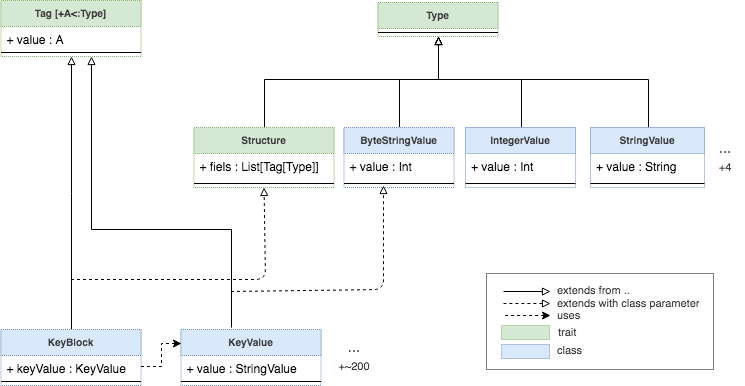

# Scala KMIP XML
[](https://travis-ci.org/maximeburri/ScalaKMIP)

**__Disclaimer__: it's a Proof of Concept (PoC) of a first architecture for encoding/decoding KMIP in XML. It is not a reliable code (use Reflection API). I work on a better binary library.**

ScalaKMIP is an Scala implementation of [KMIP](https://www.oasis-open.org/committees/kmip/) (Key Management Interoperability Protocol). 
The current project is a PoC, a first architecture design and could lead to a full implementation of KMIP 1.4.

## Architecture


A structure needs to extends from `Structure` and `Tag[Structure]`. 
The constructor is used for encoding/decoding with the Scala reflection API, 
and the signature and paramaters are used to encode and to check the decoding (cast into an object).
```scala
case class KeyBlock(
                     val keyFormatType : KeyFormatTypeEnum, 
                     val keyValue : Option[KeyValue], // Not required
                     val cryptographicLength : CryptographicLength // required but MAY be omitted only if this information is available from the Key Value
                     /*...*/
                   ) extends StructuredTag
```
The fields can ba a 
- a class extends from `Tag[A <: Type]` like 
  - `Tag[Structure]` for structures
  - `Tag[StringValue]` for string field, `Tag[IntegerValue]` for string field, etc..
  - `Tag[Enumeration]` for enumeration
- an `Option[Tag[A <: Type]]` for optional field
- a multiple fields will be a future work (`List[Tag[A <: Type]]`) or optional multiple fields (`Option[List[Tag[A <: Type]]]`)

## Examples
The XML encoding/decoding is implemented and the others (TTLV, JSON) will follow.
Note that the following structures does not follow exactly the specification and fields.

Create the KeyBlock structure
```scala
import KMIP._
import KMIP.XML._

val keyBlock = KeyBlock(
    KeyFormatTypeEnum.X509,
    Some( // Optional, can be None
      KeyValue(
        ByteStringValue(
          List[Byte](0x0, 0x1, 0x2, 0x3, 0x4, 0x5, 0x6, 0x7, 0x8, 0x9 /*...*/)
        )
      )
    ),
    CryptographicLength(
      IntegerValue(10)
    )
  )
```

For simplicity, the use of implicit conversion for values e.g `String(value)` instead of `StringValue(String(value))`
```scala
import KMIP.TypeImplicits._

val keyBlock = KeyBlock(
    KeyFormatTypeEnum.X509,
    Some( // Optional, can be None
      KeyValue(List[Byte](0x0, 0x1, 0x2, 0x3, 0x4, 0x5, 0x6, 0x7, 0x8, 0x9 /*...*/))
    ),
    CryptographicLength(10)
  )
```

Convert it into XML
```scala
toXML(keyBlock)
```
```XML
<KeyBlock type="Structure">
  <KeyFormatType type="Enumeration" value="X.509"/>
  <KeyValue type="ByteString" value="00010203040506070809abcdef"/>
  <CryptographicLength type="Integer" value="16"/>
</KeyBlock>
```

And parse from XML
```scala
val parsedXML = fromXML(keyBlockXML)
val keyBlock = parsedXML.asInstanceOf[KeyBlock]
keyBlock.cryptographicLength // KeyFormatTypeEnum.X509

```

You can see more examples for XML conversion in tests at [XMLTestsSuite.scala](src/test/scala/XMLTestsSuite.scala)


